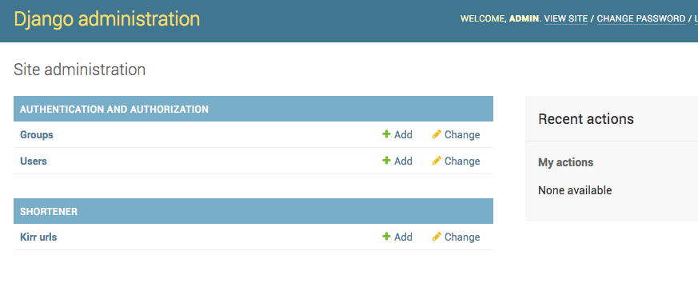
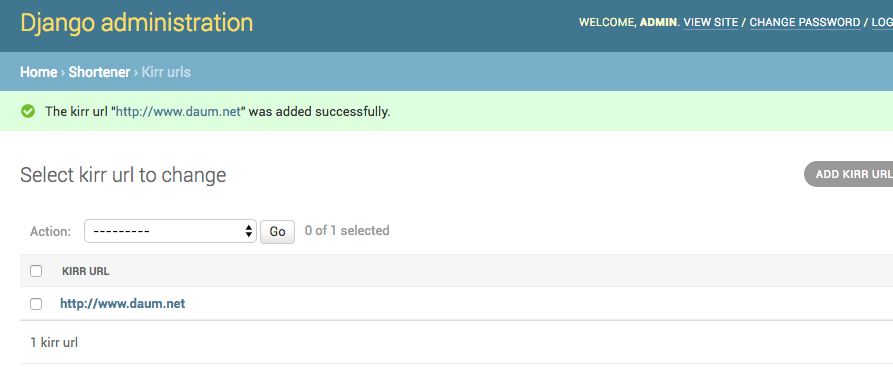
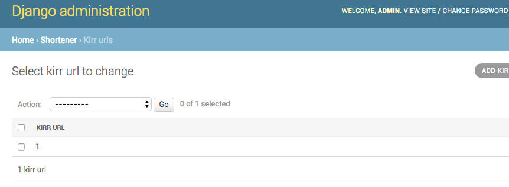

## 새로운 어플리케이션 만들기 
- 새로운 어플리케이션 만들기 
    - source/shortener 새로운 폴더 생김 
        - __init__.py
        - admin.py
        - models.py
        - views.py
    - [shortener/](../shortener/)
~~~
source $ python manage.py startapp shortener
~~~

- /source/mysite/setting.py 에 
    - 'shortener' 추가 
    - [setting.py](../mysite/settings.py)
~~~
INSTALLED_APPS = [
    'django.contrib.admin',
    'django.contrib.auth',
    'django.contrib.contenttypes',
    'django.contrib.sessions',
    'django.contrib.messages',
    'django.contrib.staticfiles',
    'shortener',
]
~~~    

 

## Model 추가 
- /shortener/models.py 
    - [models.py](../shortener/models.py)
~~~
from django.db import models

# Create your models here.
~~~     

 

- KirrURL 이라는 DB 테이블을 만든다
    - models.Model  
~~~
from django.db import models

# Create your models here.

class KirrURL(models.Model):
    pass
~~~        

- KirrURL (DB 테이블) 에 컬럼 생성 
    - url (컬럼이름)
        - 문자열 
        - 최대길이 220 글자 
    - 여러 컬럼 중에서 default 보여줄 컬럼내용을 문자열로 return 한다  
        - def \_\_str\_\_(self):
    - unicode
        - def \_\_unicode\_\_(self): 
        - python3 부터는 자동 unicode 이기 때문에 필요없음 
~~~
from django.db import models

# Create your models here.

class KirrURL(models.Model):
    url = models.CharField(max_length=220,)

    def __str__(self):
        return str(self.url)

    def __unicode__(self):
        return str(self.url)

'''
python manage.py makemigrations
python manage.py migrate
'''
~~~        

 

---

## 실제 데이터베이스에서 테이블 및 컬럼 생성하기 
- /shortener/migrations 안에는 
    - \_\_init\_\_.py 파일만 존재 
    
- makemigrations 실행 
    - models.py 에서 만든 DB 내역을 
        - sql 로 바꾸는 코드 
    - 새로운 파일이 생김 0001_initial.py
~~~
$ python manage.py makemigrations 

Migrations for 'shortener':
  shortener/migrations/0001_initial.py:
    - Create model KirrURL
~~~

- /shortener/maigrations/0001_initial.py
    - [0001_initial.py](../shortener/migrations/0001_initial.py)
    - id 컬럼은 자동적으로 생성됨 
        - primary key 로 자동 설정 
~~~
# -*- coding: utf-8 -*-
# Generated by Django 1.10 on 2017-11-23 09:09
from __future__ import unicode_literals

from django.db import migrations, models

class Migration(migrations.Migration):

    initial = True

    dependencies = [
    ]

    operations = [
        migrations.CreateModel(
            name='KirrURL',
            fields=[
                ('id', models.AutoField(auto_created=True, primary_key=True, serialize=False, verbose_name='ID')),
                ('url', models.CharField(max_length=220)),
            ],
        ),
    ]
~~~    

- migrate 
    - 코드로 생성된 파일을 sql 를 통해서 실제 데이터베이스에 생성함 
    - shortener.0001_initial.py 내용을 실행 
~~~
$ python manage.py migrate

Operations to perform:
  Apply all migrations: admin, auth, contenttypes, sessions, shortener
Running migrations:
  Rendering model states... DONE
  Applying shortener.0001_initial... OK
~~~      
            
 

---

## admin 화면에 생성된 DB 테이블 보이게 하기 
- 처음 화면 
    - /shortener/admin.py
        - [admin.py](../shortener/admin.py)
~~~
from django.contrib import admin

# Register your models here.
~~~

- 새로 추가한 KirrURL 테이블을
    - 관리자가 보일 수 있게   
~~~
from django.contrib import admin

# Register your models here.
from .models import KirrURL

admin.site.register(KirrURL)
~~~

 

- 관리자에 새롭게 만든 테이블이 보임 

- 새로운 데이터 추가 
    - http://www.daum.net 

    

- 보여지는 화면에 string(문자열) 바꾸기 
    - /shortenenr/models.py
        - def \_\_str\_\_(self): 안의 값 바꾸기 
        - self.url 를 self.id 로 바꾸면 
            - 관리자 화면에서 보여지는 값이 바뀐다 
            - 게시판 같은 경우에는 제목을 사용하기도 한다 
~~~
from django.db import models

# Create your models here.

class KirrURL(models.Model):
    url = models.CharField(max_length=220,)

    def __str__(self):
        #return str(self.url)
        return str(self.id)

    def __unicode__(self):
        return str(self.url)
~~~ 

  

 

---

## model 바꾸기 
- field types
    - [Django Field Types](https://docs.djangoproject.com/en/1.11/ref/models/fields/)
    - [models.py](../shortener/models.py)
- 컬럼 추가 
    - shortcode = models.CharField(max_length=15)
~~~
class KirrURL(models.Model):
    url = models.CharField(max_length=220,)
    shortcode = models.CharField(max_length=15)

    def __str__(self):
        return str(self.id)

    def __unicode__(self):
        return str(self.url)
~~~    
- makemigrations
    - models.py 변경
    - 모델 변경 이후에는 DB에 변경 적용하기 위해서 
- 기존의 다른 컬럼에 값이 존재할 경우 
    - 일단 멈춤 : 2
    - 1 : default 값을 설정 
        - makemigrations에 새로운 파일 생성됨 
~~~
$ python manage.py makemigrations

You are trying to add a non-nullable field 'shortcode' to kirrurl without a default; we can't do that (the database needs something to populate existing rows).
Please select a fix:
 1) Provide a one-off default now (will be set on all existing rows with a null value for this column)
 2) Quit, and let me add a default in models.py
Select an option: 2
~~~

- 옵션 설정 
    - null = False : null 값이 허용하지 않음 
    - blank = False : 아무값이 없는 것을 허용하지 않음 
    - default = '' : default 값을 ''으로 설정한다 
    - unique = True : 유일한 값으로 존재  
~~~
class KirrURL(models.Model):
    url = models.CharField(max_length=220,)
    shortcode = models.CharField(max_length=15, unique=True, null=True)
    # shortcode = models.CharField(max_length=15, null=False, blank=False)
    # shortcode = models.CharField(max_length=15, null = True)
    # shortcode = models.CharField(max_length=15 , default='')

    def __str__(self):
        return str(self.id)

    def __unicode__(self):
        return str(self.url)
~~~
- makemigrations 다시 실행 
    - 새로운 파일 생성 
        - shortener/migrations/0002_kirrurl_shortcode.py
~~~
$ python manage.py makemigrations

Migrations for 'shortener':
  shortener/migrations/0002_kirrurl_shortcode.py:
    - Add field shortcode to kirrurl
~~~

- migrate 
~~~
$ python manage.py migrate

Operations to perform:
  Apply all migrations: admin, auth, contenttypes, sessions, shortener
Running migrations:
  Rendering model states... DONE
  Applying shortener.0002_kirrurl_shortcode... OK
~~~  

 

-  Time 추가 
    - update = models.DateTimeField(auto_now = True) 
        - 컬럼의 내용을 저장될 때마다 업데이트 된다 
    - timestamp  = models.DateTimeField(auto_now_add = True) 
        - 처음 만들어질 때만 시간 추가 
~~~
class KirrURL(models.Model):
    url = models.CharField(max_length=220,)
    shortcode = models.CharField(max_length=15, unique=True, null=True)
    # shortcode = models.CharField(max_length=15, null=False, blank=False)
    # shortcode = models.CharField(max_length=15, null = True)
    # shortcode = models.CharField(max_length=15 , default='')
    
    updated     = models.DateTimeField(auto_now = True) # everytime the model is saved
    timestamp   = models.DateTimeField(auto_now_add = True) # when model was created 

    def __str__(self):
        return str(self.url)

    def __unicode__(self):
        return str(self.url)
~~~         

 

---

## 데이터베이스 모두 수정 

- 데이터베이스 파일 모두 수정할 때는 
    - makemigrations 
        - 폴더 안에는 있는 모든 파일 삭제 
    - db.sqlite3 
        - 파일 삭제 
        
 
        
- 새롭게 다시 생성된다 
    - 이후에 python manage.py createsuperuser 
    - ID: admin 
        - Email : thinkmentor@gmail.com
        - Password : admin1234
~~~
$ python manage.py createsuperuser
Username (leave blank to use 'cfe'): 
Email address : 
Password : 
Password (agin) : 
Superuser created successfully.
~~~     

- (?) 별도의 app 만 실행 -- fake 
~~~
$ python manage.py migrate shortener --fake
~~~

     

    