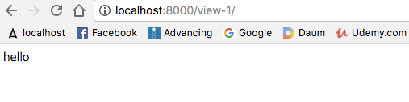
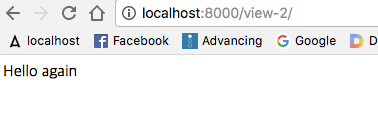
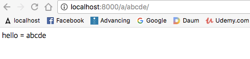
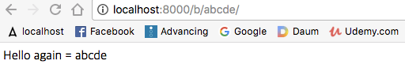
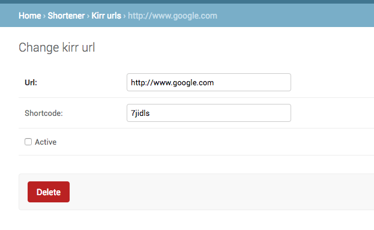
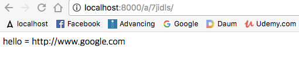
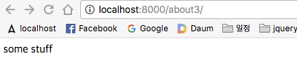

## view.py 

- /shortener/views.py
    - 보여줄 html 화면 선정하기 
    - 함수기반으로 만들기 
        - 추가 : from django.http import HttpResponse
        - 추가 : def kirr_redirect_view(request, *args, **kwargs):
            - 브라우저에 "hello" 라고 표시된다 
~~~
from django.shortcuts import render
from django.http import HttpResponse

# Create your views here.

# FB: function based view
def kirr_redirect_view(request, *args, **kwargs):
    return HttpResponse("hello") ;
~~~   

 

- /shortener/views.py
    - 클래스 기반으로 보여줄 화면 만들기 
        - 추가 : from django.views import View
        - 추가 : class KirrCBView(View):
    
~~~   
from django.shortcuts import render
from django.http import HttpResponse
from django.views import View

# Create your views here.

# FB: function based view
def kirr_redirect_view(request, *args, **kwargs):
    return HttpResponse("hello") ;

# CB : class based view
class KirrCBView(View):
    def get(self, request, *args, **kwargs):
        return HttpResponse("Hello again")
~~~   

 

## urls.py 
- /mysite/urls.py
    - 처음엔 메인에서 연결 
    - import 
        - 추가 : from shortener.views import kirr_redirect_view, KirrCBView
    - 이동 controler 
        - 추가 함수기반 : url(r'^view-1/$', kirr_redirect_view),
        - 추가 클래스기반 : url(r'^view-2/$', KirrCBView.as_view() ),
            - [url 정규표현식 가이드](https://github.com/codingforentrepreneurs/Guides/blob/master/all/common_url_regex.md)
                - [07-url_expression.md](07-url_expression.md)

~~~
from django.conf.urls import url
from django.contrib import admin

from shortener.views import kirr_redirect_view, KirrCBView

urlpatterns = [
    url(r'^admin/', admin.site.urls),
    url(r'^view-1/$', kirr_redirect_view),
    url(r'^view-2/$', KirrCBView.as_view() ),
]
~~~      

 

- http://localhost:8000/view-1/

- http://localhost:8000/view-2/

 

---

## shortcode : settings.py

- /mysite/settings.py 
    - 맨 마지막에 전역변수처럼 선언 
        - SHORTCODE_MAX = 15
        - SHORTCODE_MIN = 6 
~~~
...

LANGUAGE_CODE = 'en-us'

TIME_ZONE = 'UTC'

USE_I18N = True

USE_L10N = True

USE_TZ = True

# Static files (CSS, JavaScript, Images)
# https://docs.djangoproject.com/en/1.10/howto/static-files/

STATIC_URL = '/static/'

SHORTCODE_MAX = 15
SHORTCODE_MIN = 6
~~~   

 

- /shortener/models.py
    - 추가 : from django.conf import settings
    - 추가 : SHORTCODE_MAX = getattr(settings , "SHORTCODE_MAX", 15 )
        - settings 전역변수에서 "SHORTCODE_MAX" 값 가져오기, 크기는 15 
    - 변경 : shortcode = models.CharField(max_length=15, unique=True, blank=True)
        - max_length = 15에서 15를 SHORTCODE_MAX 상수로 변경 
~~~
from django.db import models
from django.conf import settings
# Create your models here.

from .utils import code_generator
from .utils import create_shortcode

SHORTCODE_MAX = getattr(settings , "SHORTCODE_MAX", 15 )

....

class KirrURL(models.Model):
    url = models.CharField(max_length=220,)
    shortcode = models.CharField(max_length=SHORTCODE_MAX, unique=True, blank=True)
    updated     = models.DateTimeField(auto_now = True) # everytime the model is saved
    timestamp   = models.DateTimeField(auto_now_add = True) # when model was created
    active      = models.BooleanField(default=True)

    ....
~~~     

 

- /shortener/utils.py
    - 추가 : from django.conf import settings
    - 추가 : SHORTCODE_MIN = getattr(settings , "SHORTCODE_MIN", 6 )
        - settings 전역변수에서 "SHORTCODE_MIN" 값 가져오기, 크기는 6 
    - 변경 : def code_generator(size=SHORTCODE_MIN, chars=string.ascii_lowercase+string.digits):
        - size = 6에서 6를 SHORTCODE_MIN 상수로 변경 
    - 변경 : def create_shortcode(instance, size=SHORTCODE_MIN):
        - size = 6에서 6를 SHORTCODE_MIN 상수로 변경
 
~~~
import random
import string

from django.conf import settings

SHORTCODE_MIN = getattr(settings , "SHORTCODE_MIN", 6 )

# def code_generator(size=6, chars='abcdefghijklmnopqrstuvwyxz'):
def code_generator(size=SHORTCODE_MIN, chars=string.ascii_lowercase+string.digits):
    new_code = ''
    for i in range(size):
        new_code += random.choice(chars)

    return new_code
    # return ''.join(random.choice(chars) for _ in range(size)) # 위의 코드와 같음
    
def create_shortcode(instance, size=SHORTCODE_MIN):
    # 기존 shortcode 값이 존재하면 다시 한번 더 실행
    new_code = code_generator(size=size)

    ....    
~~~    

 

- makemigrations
    - 상수로 변경했지만, 실제값이 변하지 않았기 때문에 
        - 실제 모델은 변경되지 않음
~~~
source $ python manage.py makemigrations

No changes detected
~~~

- /mysite/settings.py
    - 각각 상수값이 바뀌면 
        - makemigrations도 내용이 바뀌게 된다 
~~~
SHORTCODE_MAX = 10
SHORTCODE_MIN = 4
~~~

 

----

## slug url 
- /mysite/urls.py
    - <slug> 변경 
        - ^view-1 => 
~~~
urlpatterns = [
    url(r'^admin/', admin.site.urls),
    #url(r'^view-1/$', kirr_redirect_view),
    #url(r'^view-2/$', KirrCBView.as_view() ),
    url(r'^(?P<slug>[\w-]+)/$', kirr_redirect_view),
    url(r'^(?P<slug>[\w-]+)/$', KirrCBView.as_view()),

]
~~~

 

- /shortener/views.py
    - def kirr_redirect_view(request, *args, **kwargs):
        - args, kwargs 를 출력해본다 
    - class KirrCBView(View):
        - def get(self, request, *args, **kwargs):
            - args, kwargs 를 출력해본다
~~~
# FB: function based view
def kirr_redirect_view(request, *args, **kwargs):

    print(args)
    print(kwargs)

    return HttpResponse("hello") ;

# CB : class based view
class KirrCBView(View):
    def get(self, request, *args, **kwargs):
        print(args)
        print(kwargs)

        return HttpResponse("Hello again")
~~~

- http://localhost:8000/a/abcde/ : "hello"가 브라우저에 나타남 
- http://localhost:8000/b/abcde/ : "hello again "이 브라우저에 나타남 
    - server 가동되고 있는 콘솔에서 
        - args 값은 없고 
        - kwargs 는 "slug" 인수를 받는다 
~~~   
Starting development server at http://127.0.0.1:8000/
Quit the server with CONTROL-C.

()
{'slug': 'abcde'}
~~~ 

 

- 장고 프레임워크에서 제공하는 
    - request 
        - request.user : 사용자 
        - request.user.is_authenticated() : 인증된 사용자인지 여부 
~~~
def kirr_redirect_view(request, *args, **kwargs):

    print(request.user)
    print(request.user.is_authenticated())
    print(args)
    print(kwargs)

    return HttpResponse("hello") ;
~~~

- http://localhost:8000/a/abcde/
    - sever 콘솔 
~~~
Starting development server at http://127.0.0.1:8000/
Quit the server with CONTROL-C.

admin
True
()
{'shortcode': 'abcde'}
~~~     

 

- /shortener/views.py
    - shortcode 를 인수로 전달 
    - def kirr_redirect_view(request, shortcode=None, *args, **kwargs):
        - print(shortcode) 출력 확인 
    - class KirrCBView(View):
        - def get(self, request,shortcode=None, *args, **kwargs):
            - print(shortcode)
~~~
def kirr_redirect_view(request, shortcode=None, *args, **kwargs):

    print(request.user)
    print(request.user.is_authenticated())
    print(shortcode)
    print(args)
    print(kwargs)

    return HttpResponse("hello") ;

# CB : class based view
class KirrCBView(View):
    def get(self, request,shortcode=None, *args, **kwargs):
        print(shortcode)
        print(args)
        print(kwargs)

        return HttpResponse("Hello again")
~~~

 

- http://localhost:8000/a/abcde/
~~~
Starting development server at http://127.0.0.1:8000/
Quit the server with CONTROL-C.

admin
True
abcde
()
{}
~~~

- http://localhost:8000/b/abcde/
~~~
Starting development server at http://127.0.0.1:8000/
Quit the server with CONTROL-C.

^[[B^[[Babcde
()
{}
~~~

 

- /shortener/views.py
    - shortcode 인수로 전달한 값을 브라우저에 출력하기 
    - = {shortcode}".format(shortcode=shortcode)) ;
~~~
def kirr_redirect_view(request, shortcode=None, *args, **kwargs):
    return HttpResponse("hello = {shortcode}".format(shortcode=shortcode)) ;

# CB : class based view
class KirrCBView(View):
    def get(self, request,shortcode=None, *args, **kwargs):
        return HttpResponse("Hello again = {shortcode}".format(shortcode=shortcode)) ;
~~~

- http://localhost:8000/a/abcde/

- http://localhost:8000/b/abcde/

 

- /shortener/views.py
    - model class 추가 : from .models import KirrURL
    - shortcode 매칭값 : obj = KirrURL.objects.get(shortcode=shortcode)
    - url 문자열 리턴 : return HttpResponse("hello = {shortcode}".format(shortcode=obj.url)) 
~~~
from .models import KirrURL

# Create your views here.

# FB: function based view
def kirr_redirect_view(request, shortcode=None, *args, **kwargs):
    obj = KirrURL.objects.get(shortcode=shortcode)
    return HttpResponse("hello = {shortcode}".format(shortcode=obj.url)) ;
~~~

- admin 관리자 

- http://localhost:8000/a/7jidls/

 

- /shortener/views.py
    - shortcode 매칭하는 값이 존재하면 
        - try : obj = KirrURL.objects.get(shortcode=shortcode)
    - 매칭하는 값이 없으면 
        - 첫번째 값으로 가져오기 
        - except:obj = obj = KirrURL.objects.all().first()
~~~
def kirr_redirect_view(request, shortcode=None, *args, **kwargs):

    try :
        obj = KirrURL.objects.get(shortcode=shortcode)
    except:
        obj = obj = KirrURL.objects.all().first()

    return HttpResponse("hello = {shortcode}".format(shortcode=obj.url)) ;
~~~

- /shortener/views.py
    - shortcode 매칭하는 좀 더 나은 방법 
        - 매칭하는 값이 존재하면 해당 값이 나오고 
        - 없으면 Null 값이 브라우저에 출력 
        - return ... .format(shortcode=obj_url)) ;
~~~
def kirr_redirect_view(request, shortcode=None, *args, **kwargs):

    # try :
    #     obj = KirrURL.objects.get(shortcode=shortcode)
    # except:
    #     obj = obj = KirrURL.objects.all().first()

    obj_url = None
    qs = KirrURL.objects.filter(shortcode__iexact=shortcode.upper())
    if qs.exists() and qs.count() == 1:
        obj = qs.first()
        obj_url = obj.url 

    return HttpResponse("hello = {shortcode}".format(shortcode=obj_url)) ;
~~~

- /shortener/views.py
    - 추가 import : from django.shortcuts import get_object_or_404
    - obj = get_object_or_404(KirrURL, shortcode=shortcode)
        - 값이 존재하지 않으면 404 에러 처리하면 됨 
        - return ... .format(shortcode=obj.url)) ;

~~~
....

from django.shortcuts import get_object_or_404

....

# FB: function based view
def kirr_redirect_view(request, shortcode=None, *args, **kwargs):

    # try :
    #     obj = KirrURL.objects.get(shortcode=shortcode)
    # except:
    #     obj = obj = KirrURL.objects.all().first()

    # obj_url = None
    # qs = KirrURL.objects.filter(shortcode__iexact=shortcode.upper())
    # if qs.exists() and qs.count() == 1:
    #     obj = qs.first()
    #     obj_url = obj.url

    obj = get_object_or_404(KirrURL, shortcode=shortcode)

    return HttpResponse("hello = {shortcode}".format(shortcode=obj.url)) ;
~~~ 

- /shortener/views.py
    - 클래스 기반 View
    - 추가 import : from django.shortcuts import get_object_or_404
    - obj = get_object_or_404(KirrURL, shortcode=shortcode)
        - 값이 존재하지 않으면 404 에러 처리하면 됨 
        - return ... .format(shortcode=obj.url)) ;

~~~
# CB : class based view
class KirrCBView(View):
    def get(self, request,shortcode=None, *args, **kwargs):
        obj = get_object_or_404(KirrURL, shortcode=shortcode)
        return HttpResponse("Hello again = {shortcode}".format(shortcode=shortcode)) ;
~~~
   
 

---

## Get, Post

- /shortener/views.py
    - request.method 출력 
~~~
def kirr_redirect_view(request, shortcode=None, *args, **kwargs):

    print(request.method)
~~~   

- http://localhost:8000/a/o5srr5/
    - 서버 콘솔 
~~~
GET

[24/Nov/2017 12:40:23] "GET /a/o5srr5/ HTTP/1.1" 200 26
~~~

 

---

## HttpResponseRedirect 
- /shortener/views.py
    - import 추가 : from django.http import HttpResponseRedirect
        - 마지막에 주어지는 인수의 값으로 바로 이동가능
    - return HttpResponseRedirect(obj.url)
        - obj.url 값으로 바로 이동 
~~~
....

from django.http import HttpResponseRedirect

....

def kirr_redirect_view(request, shortcode=None, *args, **kwargs):
    obj = get_object_or_404(KirrURL, shortcode=shortcode)
    # return HttpResponse("hello = {shortcode}".format(shortcode=obj.url)) ;
    return HttpResponseRedirect(obj.url)

# CB : class based view
class KirrCBView(View):
    def get(self, request,shortcode=None, *args, **kwargs):
        obj = get_object_or_404(KirrURL, shortcode=shortcode)
        # return HttpResponse("Hello again = {shortcode}".format(shortcode=shortcode)) ;
        return HttpResponseRedirect(obj.url)

    def post(self, request, *args, **kwargs):
        return HttpResponse()
~~~

- http://localhost:8000/a/o5srr5/
    - 해당하는 views 가 처리되고 
        - obj.url 로 바로 이동 
        
----

- /mysite/urls.py
    - 최소개수=6, 최대개수=15 설정 : {6,15}
        - url(r'^a/(?P<shortcode>[\w-]+){6,15}/$', kirr_redirect_view),
~~~
urlpatterns = [
    url(r'^admin/', admin.site.urls),
    # url(r'^view-1/$', kirr_redirect_view),
    # url(r'^view-2/$', KirrCBView.as_view() ),
    url(r'^a/(?P<shortcode>[\w-]+){6,15}/$', kirr_redirect_view),
    url(r'^b/(?P<shortcode>[\w-]+){6,15}/$', KirrCBView.as_view()),
]               
~~~

 

---

- /shortener/views.py
    - 새로운 함수 생성 
~~~
def test_view(request):
    return HttpResponse("some stuff")
~~~

- /mysite/urls.py
    - import 추가 : 
        - from shortener.views import test_view
    - url 추가 
        - url(r'^about3/$', test_view),
~~~
....
from shortener.views import test_view
....

urlpatterns = [
    url(r'^admin/', admin.site.urls),
    url(r'^about3/$', test_view),    
    url(r'^a/(?P<shortcode>[\w-]+){6,15}/$', kirr_redirect_view),
    url(r'^b/(?P<shortcode>[\w-]+){6,15}/$', KirrCBView.as_view()),
]
~~~

- http://localhost:8000/about3/

