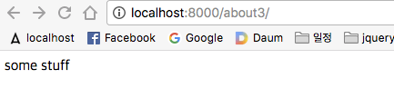

## localhost 
~~~
$ sudo vi /etc/hosts

##
# Host Database
#
# localhost is used to configure the loopback interface
# when the system is booting.  Do not change this entry.
##
127.0.0.1       localhost
255.255.255.255 broadcasthost
::1             localhost
fe80::1%lo0     localhost
~~~

- 도메인 설정하기 
    - 새로운 도메인 추가 
        - 127.0.0.1       test.com
        - 127.0.0.1       www.test.com
        - 127.0.0.1       blog.test.com
~~~
##
# Host Database
#
# localhost is used to configure the loopback interface
# when the system is booting.  Do not change this entry.
##
127.0.0.1       localhost
127.0.0.1       test.com
127.0.0.1       www.test.com
127.0.0.1       blog.test.com
255.255.255.255 broadcasthost
::1             localhost
fe80::1%lo0     localhost
~~~    

- http://localhost:8000/about3/

- http://www.test.com:8000/about3/
    - 새롭게 설정된 도메인 

---

- /mysite/settings.py
    - 제한된 도메인만 접근 가능하도록
    - DEBUG = False  
~~~
....

DEBUG = False

ALLOWED_HOSTS = ['www.test.com']

....
~~~

 

- 정상 접근 
    - http://www.test.com:8000/about3/

- 비정상 접근 
    - http://localhost:8000/about3/
    - 400 에러 : Bad Request, 요청 실패 - 문법상 오류가 있어서 서버가 요청 사항을 이해하지 못함. 

  

 

---

## Django Hosts 
- 서브도메인 설정 
    - blog.test.com

 

- 가상환경에서 pip install django-hosts
    - http://django-hosts.readthedocs.io/en/latest/
~~~
(lec_django_1_10) source $ pip install django-hosts

Collecting django-hosts
  Downloading django_hosts-3.0-py2.py3-none-any.whl
Installing collected packages: django-hosts
Successfully installed django-hosts-3.0
~~~

- /mysite/settings.py
    - installed_apps 에 'django-hosts' 추가 
        - http://django-hosts.readthedocs.io/en/latest/ : Installation
~~~
INSTALLED_APPS = [
    'django.contrib.admin',
    'django.contrib.auth',
    'django.contrib.contenttypes',
    'django.contrib.sessions',
    'django.contrib.messages',
    'django.contrib.staticfiles',
    # third party
    'django_hosts'
    # custom app
    'shortener',
]
~~~

- middleware 가상 상단에 추가 
    - 'django_hosts.middleware.HostsRequestMiddleware'
        - http://django-hosts.readthedocs.io/en/latest/ : Installation
~~~
MIDDLEWARE = [
    'django_hosts.middleware.HostsRequestMiddleware'
    'django.middleware.security.SecurityMiddleware',
    'django.contrib.sessions.middleware.SessionMiddleware',
    'django.middleware.common.CommonMiddleware',
    'django.middleware.csrf.CsrfViewMiddleware',
    'django.contrib.auth.middleware.AuthenticationMiddleware',
    'django.contrib.messages.middleware.MessageMiddleware',
    'django.middleware.clickjacking.XFrameOptionsMiddleware',
]
~~~

- middleware 가상 하단에 추가 
    - 'django_hosts.middleware.HostsResponseMiddleware' 
        -  http://django-hosts.readthedocs.io/en/latest/ : Installation
~~~
MIDDLEWARE = [
    'django_hosts.middleware.HostsRequestMiddleware'
    'django.middleware.security.SecurityMiddleware',
    'django.contrib.sessions.middleware.SessionMiddleware',
    'django.middleware.common.CommonMiddleware',
    'django.middleware.csrf.CsrfViewMiddleware',
    'django.contrib.auth.middleware.AuthenticationMiddleware',
    'django.contrib.messages.middleware.MessageMiddleware',
    'django.middleware.clickjacking.XFrameOptionsMiddleware',
    'django_hosts.middleware.HostsResponseMiddleware' 
]
~~~      

 

---

- /mysite/안에 
    - hosts.py 파일 생성 
    
 

- /mysite/settings.py 에서 
    -  추가 ROOT_HOSTCONF = 'mysite.hosts'  
~~~
ROOT_URLCONF = 'mysite.urls'
ROOT_HOSTCONF = 'mysite.hosts'
~~~

 

- /mysite/hosts.py 파일안에 복사 
    - http://django-hosts.readthedocs.io/en/latest/ : Usage
~~~    
from django.conf import settings
from django_hosts import patterns, host

host_patterns = patterns('',
    host(r'www', settings.ROOT_URLCONF, name='www'),
    host(r'(\w+)', 'path.to.custom_urls', name='wildcard'),
)
~~~

- /mysite/hosts.py 안의 
    - www 를 default 로 잡기 
- /mysite/settings.py 에 
    - 추가 : DEFAULT_HOST = 'www'
        - http://django-hosts.readthedocs.io/en/latest/ : Installation
~~~
ROOT_URLCONF = 'mysite.urls'
ROOT_HOSTCONF = 'mysite.hosts'
DEFAULT_HOST = 'www'
~~~        
     
 

- /mysite/hosts.py 안에 
    - www 시작하는 도메인 잡기 
        - 추가 : host(r'(?!www).*', 'path.to.custom_urls', name='wildcard'),
~~~
host_patterns = patterns('',
    host(r'www', settings.ROOT_URLCONF, name='www'),
    host(r'(?!www).*', 'path.to.custom_urls', name='wildcard'),
    # host(r'(\w+)', 'path.to.custom_urls', name='wildcard'),
)
~~~          
    
 

- /mysite/ 안에 
    - /hostsconf/ 패키지 만들기 
        - \_\_init\_\_.py 파일 생성   
        - urls.py 파일 생성 
        - views.py 파일 생성 
 

- /mysite/hosts.py 
    - path.to.custom_urls를 mysite.hostsconf.urls 로 변경 
~~~
host_patterns = patterns('',
    host(r'www', settings.ROOT_URLCONF, name='www'),
    host(r'(?!www).*', 'mysite.hostsconf.urls', name='wildcard'),
    # host(r'(\w+)', 'path.to.custom_urls', name='wildcard'),
)
~~~   

- 위의 것을 아래의 주석처럼 가능 
~~~
from django.conf import settings
from django_hosts import patterns, host

host_patterns = patterns('',
    host(r'www', settings.ROOT_URLCONF, name='www'),
    host(r'(?!www).*', 'mysite.hostsconf.urls', name='wildcard'),
    # host(r'(\w+)', 'path.to.custom_urls', name='wildcard'),
)

'''
from mysite.hostsconf import urls as redirect_urls
host_patterns = [
    host(r'www', settings.ROOT_URLCONF, name='www'),
    host(r'(?!www).*', redirect_urls, name='wildcard'),
]
'''
~~~     

 

- /mysite/urls.py 를 
    - /mysite/hostsconf/urls.py 에 복사 
~~~
from django.conf.urls import url
from django.contrib import admin

from shortener.views import kirr_redirect_view, KirrCBView
from shortener.views import test_view

urlpatterns = [
    url(r'^admin/', admin.site.urls),
    url(r'^about3/$', test_view),
    url(r'^a/(?P<shortcode>[\w-]+){6,15}/$', kirr_redirect_view),
    url(r'^b/(?P<shortcode>[\w-]+){6,15}/$', KirrCBView.as_view()),
]
~~~    

 

- /mysite/settings.py 추가
    - 전역변수 처럼 : DEFAULT_REDIRECT_URL = "http://www.test.com" 
~~~
ROOT_URLCONF = 'mysite.urls'
ROOT_HOSTCONF = 'mysite.hosts'
DEFAULT_HOST = 'www'
DEFAULT_REDIRECT_URL = "http://www.test.com:8000"
~~~

 

- /mysite/hostsconf/views.py 작성 
~~~
from django.conf import settings
from django.http import HttpResponseRedirect

DEFAULT_REDIRECT_URL = getattr(settings, "DEFAULT_REDIRECT_URL","http://www.test.com:8000")
def wildcard_redirect(request, path=None):
    new_url = DEFAULT_REDIRECT_URL

    if path is not None :
        new_url = DEFAULT_REDIRECT_URL + "/" + path
        
    return HttpResponseRedirect(new_url)
~~~
     
 

- /mysite/hostsconf/urls.py 의 코드를 아래처럼 수정
~~~
from django.conf.urls import url

from .views import wildcard_redirect
urlpatterns = [
    url(r'^(?P<path>.*)', wildcard_redirect),
]
~~~     

- 모두 셋팅이후 
    - http://www.test.com:8000/my-shortcode/
        - my-shortcode 는 임의의 값 

    

 

- /mysite/hosts.py
    - 현재 상태에서는 앞에 어떤 서브도메인을 넣어도 
    - http://www.test.com:8000/my-shortcode/ 
        - 앞부분이 blog,abc => www 로 변경됨 
~~~
host_patterns = patterns('',
    host(r'www', settings.ROOT_URLCONF, name='www'),
    host(r'(?!www).*', 'mysite.hostsconf.urls', name='wildcard'),
    # host(r'(\w+)', 'path.to.custom_urls', name='wildcard'),
)
~~~    

- /mysite/hosts.py
    - blog 추가 
        - host(r'blog', settings.ROOT_URLCONF, name='blog'),
~~~
host_patterns = patterns('',
    host(r'www', settings.ROOT_URLCONF, name='www'),
    host(r'blog', settings.ROOT_URLCONF, name='blog'),
    host(r'(?!www).*', 'mysite.hostsconf.urls', name='wildcard'),
    # host(r'(\w+)', 'path.to.custom_urls', name='wildcard'),
)
~~~
- http://blog.test.com:8000/my-shortcode/
    - blog가 www 로 변경되지 않음 
    
    
    

  

    

